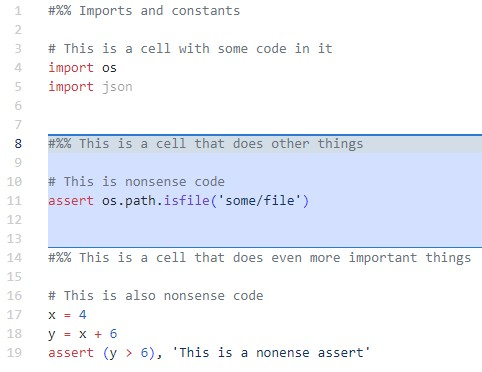

# Python Cell Highlighter

A Visual Studio Code extension that highlights the current Python cell (delimited by #%% or # %%) with a custom background color, similar to MATLAB and Spyder, like this:



## Features

- Automatically highlights the current Python cell as you move your cursor
- Supports both `#%%` and `# %%` cell delimiter formats
- Configurable background color
- Toggle highlighting on/off with a keyboard shortcut

## Installation

### From VSIX File

1. Download the `.vsix` file
2. Open VS Code
3. Go to Extensions view (Ctrl+Shift+X)
4. Click the "..." menu at the top of the Extensions view
5. Select "Install from VSIX..."
6. Navigate to and select the `.vsix` file

### Build It Yourself

1. Clone or download this repository
2. Ensure you have Node.js and npm installed.  Typically you can install both by running the installer from <https://nodejs.org/en>.  If you want to verify that node and npm are installed, open a command prompt and run:
   ```bash
   node --version
   npm --version
   ```
3. Open a terminal in the extension directory
4. Run the following commands:
   ```bash
   # Initialize the npm project
   npm init -y
   
   # Install dev dependencies
   npm install --save-dev @types/vscode eslint
   
   # Install the packaging tool
   npm install -g @vscode/vsce
   
   # Package the extension
   vsce package
   ```
5. This will create a `.vsix` file that you can install as described above

## Requirements

- VS Code version 1.99.0 or higher

## Extension Settings

This extension contributes the following settings:

* `pythonCellHighlighter.backgroundColor`: Sets the background color for the current cell (default: "rgba(100, 150, 255, 0.3)")

## Keyboard Shortcuts

* Toggle highlighting: `Ctrl+Shift+H` (Windows/Linux) or `Cmd+Shift+H` (macOS)

## Using the Extension

- The extension activates automatically when you open a Python file
- It highlights the current cell (area between `#%%` or `# %%` delimiters)
- The highlighting updates automatically as you move your cursor

## Troubleshooting

If you encounter any issues:

1. Check the Output panel (View > Output) and select "Extension Host" from the dropdown
2. Make sure your Python files use `#%%` or `# %%` as cell delimiters
3. Try reloading the VS Code window (Developer: Reload Window from the command palette)

## Development Guide

If you want to develop the extension further:

1. Clone the repository
2. Run `npm install` to install dependencies
3. Make your changes to the code
4. Press F5 to start debugging in a new VS Code window with the extension loaded
5. Changes can be tested immediately in this window

## Release Notes

### 0.1.0

Initial release of Python Cell Highlighter
